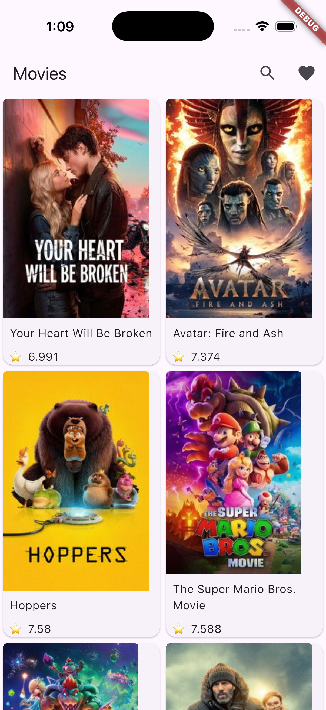
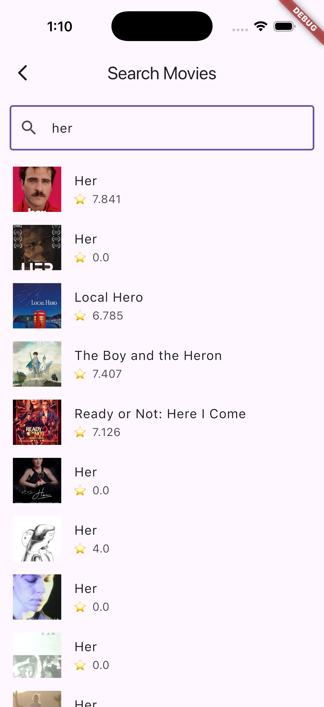
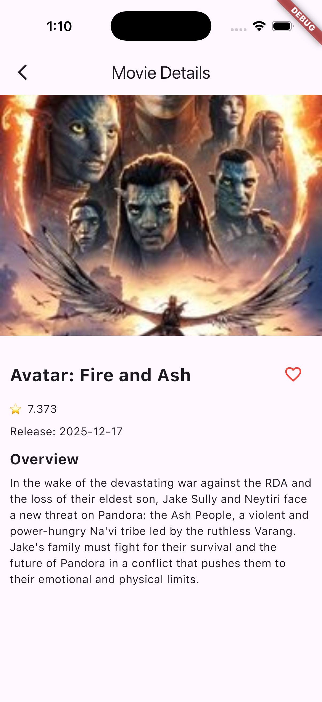

# Movie Explorer App

A Flutter application that displays popular movies, movie details, search functionality, and offline favorites. Built with Clean Architecture principles, featuring offline caching, responsive UI, and comprehensive error handling.

## Features

- 🎬 **Popular Movies Display**: Grid view of popular movies with posters, titles, and ratings
- 📱 **Movie Details**: Full movie information including overview, rating, release date, and poster/backdrop
- 🔍 **Search Functionality**: Search movies by keyword with debounce and infinite scroll
- ❤️ **Offline Favorites**: Save favorite movies locally using Hive database
- 🔄 **Pull-to-Refresh**: Refresh movie data by pulling down
- 💾 **Offline Caching**: Hive-based caching for favorites with persistent storage
- 📱 **Responsive Design**: Adapts to both portrait and landscape orientations
- ⚠️ **Error Handling**: Graceful error handling with retry functionality
- 🧪 **Comprehensive Testing**: Unit tests for use cases, repositories, and bloc

## Screenshots

<table>
  <tr>
    <td align="center">
      
      <p><strong>Home</strong></p>
    </td>
    <td align="center">
      
      <p><strong>Search</strong></p>
    </td>
  </tr>
  <tr>
    <td align="center">
      
      <p><strong>Details</strong></p>
    </td>
    <td align="center">
      
      <p><strong>Favorites</strong></p>
    </td>
  </tr>
</table>

> Tip: capture the app in a device or simulator, save the images to `screenshots/`, and update the file names here.

## Architecture

This project follows **Clean Architecture** principles, organized into three main layers:

### Layer Structure
lib/
├── core/ # Core utilities and services
│ ├── cache/ # Hive cache setup
│ ├── network/ # Dio client and interceptors
│ ├── routes/ # App routing
│ └── util/ # Helper utilities
│
├── domain/ # Business logic layer (no external dependencies)
│ ├── entities/ # Movie entities
│ ├── repositories/ # Repository interfaces
│ └── usecases/ # GetPopularMovies, SearchMovies, GetMovieDetails, ToggleFavorite
│
├── data/ # Data layer
│ ├── datasources/ # Remote (API) and Local (Hive cache)
│ ├── models/ # DTOs with JSON parsing
│ └── repositories/ # Repository implementations
│
├── features/movie/ # Feature-specific code
│ ├── presentation/ # UI layer
│ │ ├── bloc/ # MovieBloc and MovieState
│ │ ├── cubit/ # SearchCubit, MovieDetailsCubit, FavouritesCubit
│ │ ├── screen/ # HomeScreen, SearchScreen, MovieDetailsScreen, FavouriteScreen
│ │ └── widget/ # MovieCard and other widgets
│ └── data/ # Feature data sources and models
│
└── injections/ # Dependency injection (GetIt)
└── service_locator.dart

### Architecture Principles

1. **Dependency Rule**: Dependencies flow inward (Presentation → Domain ← Data)
   - Domain layer has no dependencies on other layers
   - Presentation depends on Domain
   - Data depends on Domain

2. **Separation of Concerns**:
   - **Presentation**: UI, state management (Bloc/Cubit), widgets
   - **Domain**: Business logic, entities, use cases
   - **Data**: API calls, caching, data models

3. **Dependency Injection**: All dependencies injected via GetIt
   - Controllers/Blocs/Cubits don't create their own dependencies
   - All registered as lazy singletons or factories

4. **Testability**: Clean interfaces allow easy mocking and testing

## Dependencies

### Core Dependencies

- **flutter_bloc** (^7.0.0): State management with Bloc and Cubit
- **dio** (^5.9.2): HTTP client for API requests
- **get_it** (^9.2.1): Dependency injection
- **hive_flutter** (^1.1.0): Local database for favorites
- **hive** (^2.2.3): Hive database core
- **flutter_dotenv** (^6.0.0): Environment variable management
- **connectivity_plus** (^7.1.0): Network connectivity status
- **cached_network_image** (^3.3.1): Image caching and loading
- **equatable** (^2.0.8): Value equality for state classes

### Development Dependencies

- **flutter_test**: Built-in testing framework
- **mocktail** (^0.2.0): Mocking library for tests
- **bloc_test** (^8.0.0): Bloc testing utilities
- **flutter_lints** (^6.0.0): Linting rules
- **build_runner** (^2.13.1): Code generation

## Prerequisites

- Flutter SDK >= 3.0.0
- Dart SDK (comes with Flutter)
- Android Studio / VS Code with Flutter extensions
- TMDb API key ([Get one here](https://www.themoviedb.org/settings/api))

## Setup & Installation

### 1. Clone the Repository

```bash
git clone <your-repo-url>
cd movie_explorer_app
```

### 2. Install Dependencies

```bash
flutter pub get
```

### 3. Configure API Key

The API key is configured via environment variables.

**Option 1: Environment File (Recommended)**
- Copy the example environment file:
  ```bash
  cp .env.example .env
  ```
- Open `.env` and add your TMDb API key:
  ```
  API_KEY=YOUR_TMDB_API_KEY
  API_BASE_URL=https://api.themoviedb.org/3
  ```

**Option 2: Command Line (For CI/CD)**
```bash
flutter run --dart-define=TMDb_API_KEY=your_api_key_here
```

### 4. Platform-Specific Setup

#### Android
- Location permissions are already configured in `AndroidManifest.xml`
- No additional setup required

#### iOS
- Run `pod install` in the `ios` directory:
  ```bash
  cd ios
  pod install
  cd ..
  ```

## How to Run

### Run on Connected Device/Emulator

```bash
# Run on default device
flutter run

# Run on specific device
flutter devices
flutter run -d <device-id>

# Run in release mode
flutter run --release
```

### Build for Production

```bash
# Android
flutter build apk --release
# or
flutter build appbundle --release

# iOS
flutter build ios --release
```

## Running Tests

### Run All Tests

```bash
flutter test
```

### Run Specific Test Files

```bash
# Run use case tests
flutter test test/usecases/

# Run repository tests
flutter test test/repositories/

# Run bloc tests
flutter test test/blocs/

# Run all tests with coverage
flutter test --coverage
```

### Test Structure

- **Unit Tests**:
  - Use case tests (`test/usecases/`)
  - Repository tests (`test/repositories/`)
  - Bloc tests (`test/blocs/`)
- **Test Helpers**: Mock classes in `test/mocks.dart`
- **Test Data**: Helper classes for creating test entities and JSON

## Project Structure Details

### Domain Layer
- **Entities**: Pure Dart classes representing business objects
  - `Movie` with id, title, overview, posterPath, rating, releaseDate
- **Use Cases**: Single responsibility business logic
  - `GetPopularMovies`: Fetches popular movies with pagination
  - `SearchMovies`: Searches movies by query with pagination
  - `GetMovieDetails`: Fetches detailed movie information
  - `ToggleFavourite`: Adds/removes movie from favorites
  - `GetFavouriteMovies`: Retrieves all favorite movies
- **Repositories**: Abstract interfaces defining data contracts

### Data Layer
- **Remote Data Source**: HTTP API calls using Dio to TMDb API
- **Local Data Source**: Hive-based storage for favorites
- **Repository Implementation**: Coordinates between remote and local sources
- **Models**: JSON parsing and entity conversion for MovieModel

### Presentation Layer
- **Bloc/Cubit**: `MovieBloc`, `SearchCubit`, `MovieDetailsCubit`, `FavouritesCubit`
- **States**: Loading, Loaded, Error states for each feature
- **Screens**: Home, Search, Details, Favorites screens
- **Widgets**: Reusable UI components like MovieCard

## Key Features Implementation

### Offline Favorites
- Uses Hive for local storage of favorite movies
- Persistent storage across app sessions
- Add/remove favorites with immediate UI feedback

### Search with Debounce
- 500ms debounce timer prevents excessive API calls
- Infinite scroll pagination for search results
- Real-time search as user types

### Error Handling
- Network errors handled gracefully with retry buttons
- API errors with user-friendly messages
- Loading states with progress indicators
- Error messages displayed in UI with retry functionality

### State Management
- Bloc for popular movies (complex state with pagination)
- Cubits for search, details, and favorites (simpler state management)
- Proper state transitions and loading indicators

## API Integration

### The Movie Database (TMDb) API

- **Popular Movies Endpoint**: `GET /movie/popular`
- **Movie Details Endpoint**: `GET /movie/{movie_id}`
- **Search Movies Endpoint**: `GET /search/movie`
- **Base URL**: `https://api.themoviedb.org/3`
- **Image Base URL**: `https://image.tmdb.org/t/p/w200` (for posters)

## Troubleshooting

### API Key Issues
- Verify API key is correct in `.env` file
- Check TMDb API key has proper permissions
- Ensure `.env` is not committed to version control

### Network Issues
- Check internet connection
- Verify API endpoints are accessible
- Check Dio interceptors for request/response logging

### Cache Issues
- Favorites stored in device storage via Hive
- To clear favorites: Uninstall and reinstall the app
- Cache persists across app updates

### Test Failures
- Run `flutter pub get` to ensure all dependencies
- Check mock classes in `test/mocks.dart`
- Verify test data matches expected formats

## Future Improvements

- [ ] Dark/Light theme toggle
- [ ] Movie trailer integration
- [ ] User authentication and watchlist
- [ ] Offline movie caching
- [ ] Push notifications for new releases
- [ ] Widget tests for UI components
- [ ] Integration tests
- [ ] CI/CD pipeline setup

## License

This project is created as a Flutter developer assignment.

## Author

Virendra Kumar

---

**Note**: Remember to add your TMDb API key before running the app. The API key is required for the app to fetch movie data.
